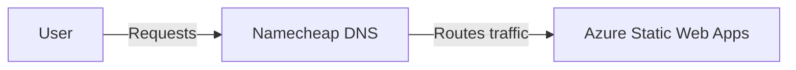

# Overview

[abhish3kk.in](https://abhish3kk.in) is my personal website designed to showcase my skills, projects, and technical expertise. It is built with Vue 3 and deployed on Azure Static Web Apps, integrating Pinia for state management and a modular architecture.

## Build & Run

The project uses **Vite** for development and build processes. Below are the key scripts defined in `package.json`:

```json
"scripts": {
    "dev": "vite",
    "build": "vue-tsc -b && vite build",
}
```

- To start the development server:

```sh
npm run dev
```

- To build the project for production:

```sh
npm run build
```

### Project Structure

```
src
├── App.vue
├── components
│   ├── DarkLight.vue
│   ├── MermaidDiagram.vue
│   └── Nav.vue
├── constants
│   └── index.ts
├── content
│   └── projects
│       ├── abhish3kk.in.md
│       └── repofinder.md
├── i18n
│   ├── index.ts
│   └── locales
│       └── en.json
├── layouts
├── main.ts
├── pages
│   ├── Home.vue
│   ├── NotFound.vue
│   ├── Project.vue
│   └── Projects.vue
├── router
│   ├── index.ts
│   └── routes.ts
├── store
│   └── index.ts
├── style.css
├── types
├── utils
│   └── markdown.ts
└── vite-env.d.ts
```

## Architecture

This section describes how traffic flows from the client to the hosted application.

### Network Flow



### Application Flow

```mermaid
graph TD
    Home["Home Page"] -->|Navigation| Projects["Projects"]
    Home -->|Theme Toggle| DarkLight["🌗 Dark/Light Mode"]

    Projects -->|View Project| Project1["Project 1"]
    Projects -->|View Project| Project2["Project 2"]

    Project1 -->|Description| P1Details["Project 1 Detail"]
    Project2 -->|Description| P2Details["Project 2 Detail"]

```


