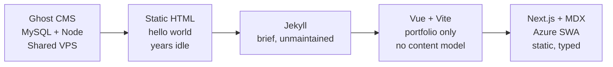
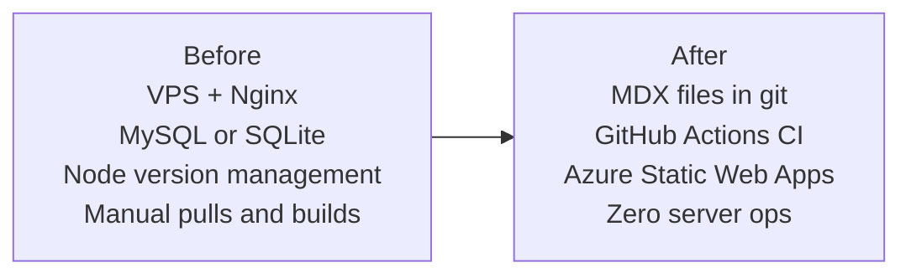
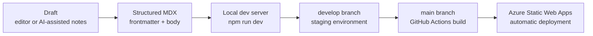

## The Problem

The problem was never building the website. That part is always the fun bit.

The problem was keeping it alive with the time you actually have left after work. Every iteration of this site started with enthusiasm and ended the same way — infrastructure demanding attention while the writing stopped.

What I needed was a platform that would disappear into the background. One where the effort stayed on writing, not ops.

## How It Got Here

The first serious version ran Ghost CMS — full CKEditor interface, MySQL backing it, running on a shared server a friend let me use. At the time it felt sophisticated: drafts, previews, a proper publishing UI with formatted headings and bullets you could see rendered before hitting publish.

Then the friend decided to exit the arrangement. Suddenly I was staring at a database export I didn't fully understand, a Node version that was behind, and no clear migration path. Being fairly new to the tooling at the time, I genuinely considered putting the SQL dump into a GitHub repo. That is the kind of situation you end up in when the infrastructure is doing too much.

After that: a period of hello-world pages, then a Jekyll phase that didn't last, then a Vue and Vite portfolio that looked fine but still had nowhere to put long-form writing. No content model, no rendering pipeline, no structure. Just project cards and links.

Each iteration had the same failure pattern. The one-time setup was easy. The ongoing maintenance was the thing that eventually won.

## What Actually Changed

The shift to Next.js App Router with MDX was not about the framework. It was about giving content a durable home without introducing a runtime system to maintain.

Several things were explicitly left out:

- No CMS, no admin UI, no content API
- No database
- No VPS to manage
- No Nginx configuration
- No server-side Node process
- No manual deployment steps

What replaced them: `.mdx` files in a git repository, validated at build time, rendered to static HTML by GitHub Actions, deployed automatically to Azure Static Web Apps.

Azure Static Web Apps are also free at the scale this site operates. No compute bill, no uptime monitoring, no surprise invoices. The hosting is invisible, which is exactly what hosting should be.

## Current Content Architecture

Each case study is a single `.mdx` file under `content/case-studies/`. The frontmatter carries typed metadata: title, summary, status, year, role, stack, and domains. A custom Zod schema validates every field at build time inside `lib/content-schema.ts`. If a field is missing or the wrong type, the build stops. No broken or incomplete pages end up deployed.

```mermaid
flowchart LR
    MDX[".mdx file\nfrontmatter + body"] --> Parse["parseFrontmatter\ncustom line parser"]
    Parse --> Schema["Zod schema\nbuild-time validation"]
    Schema --> RT["calculateReadingTime\nstripped word count ÷ 200"]
    RT --> CS["CaseStudy object\nslug + metadata + content"]
    CS --> Page["page.tsx\ngenerateStaticParams"]
    Page --> Prose["Prose wrapper\nTailwind typography"]
    Prose --> MdxContent["MdxContent\nregex block parser"]
    MdxContent --> Render["Static HTML\nMermaid · Code · Tables"]
```

The `MdxContent` component is a small custom parser — a line-by-line state machine that identifies headings, lists, code fences, mermaid blocks, and tables, mapping each to a React element. No MDX runtime ships to the browser. The build processes the markdown; the browser receives static HTML.

Reading time is calculated at build time by stripping markdown syntax, counting words, and dividing by 200 words per minute. It is stored on the content object and rendered on the page. A small detail, but one that makes a piece feel complete rather than approximate.

## Publishing Workflow

The workflow is a standard git flow with no manual steps after the merge.

Write the article, structure it as MDX, validate the frontmatter locally, push to `develop` for staging, merge to `main`. GitHub Actions picks up the build and pushes to Azure. Nothing to pull on a server, nothing to restart, no Nginx configuration to touch.

The Node upgrade story is also simpler now. When Node needs bumping, it changes in the local dev environment and in the CI workflow file. There is no server sitting somewhere with a stale version waiting to fail a deployment at 11pm.

## The AI-Assisted Drafting Loop

One thing that changed in this version is how writing starts. Earlier versions stalled because committing thoughts to structure took more friction than the available time allowed. Using a model as a rubber duck — feeding it rough notes, observations, and half-formed ideas — means the first draft arrives faster, and the editorial pass afterward is where the actual thinking happens.

The workflow: write rough context and decisions in any format, feed it to the model for structure and coherence, then edit it back to sound like the actual observations rather than a polished summary. The drafting overhead drops; the editorial work stays. That is the right tradeoff — the thinking has to remain yours.

## Tradeoffs

Publishing is developer-only. There is no editor UI, no draft system, no scheduled publishing. For a single-author site meant to read like engineering notes rather than a product blog, that is an intentional constraint rather than a missing feature. A CMS would add complexity without adding much.

There is also no search. The content set is small enough that navigation and reasonable titles are sufficient. A search index would mean introducing a new service, a sync step, a build dependency. Not worth it at this scale, possibly not ever.

The Zod schema means adding a new content type requires updating the schema first. That feels like friction occasionally, but it has prevented more than a few cases where a half-filled frontmatter would have silently produced a broken page.

## Current State

The site works and stays out of the way. A new case study takes time to write and one git push to deploy. The infrastructure is invisible.

Whether any of this is interesting to someone else is secondary. The primary goal was to stop losing articles to maintenance events. Three versions in, that is the thing that was finally fixed.

The content is the only moving part that matters. Everything else should stay still.
