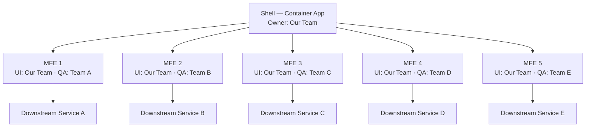
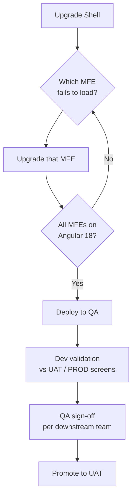
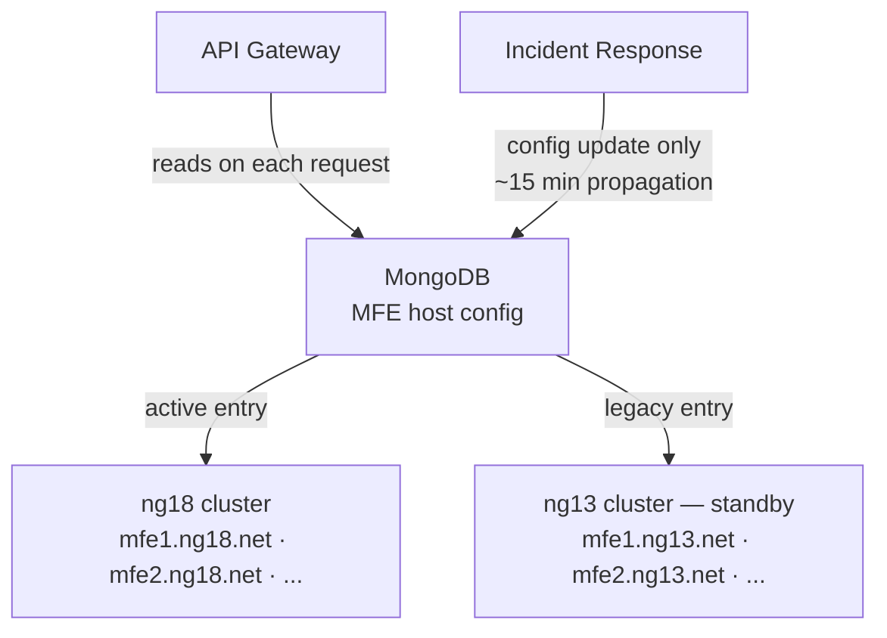

## Context

The platform consisted of six microfrontends: a shell container app and five feature MFEs. All were running Angular 13 and had accumulated enough internal coupling that the EMODS dependency-sharing constraint made a cross-MFE Angular upgrade non-negotiable—every MFE had to land on Angular 18 together or none of them would share dependencies correctly.

Alongside the Angular jump, ag-Grid was upgraded from version 29 to 32. The major version gap introduced a significant set of breaking changes, particularly in the column API, which affected every MFE that rendered a grid.

The ownership model added another layer of difficulty. While our team owned the UI modules for all six MFEs, each MFE had downstream services owned by independent teams. QA sign-off for each MFE belonged to that downstream team's QA function, not ours. This meant a broken grid column or a missing form field could not be unblocked by our team alone—we needed to route issues through the correct owners and wait for their validation cycles.

### Ownership Map



## Upgrade Approach

Each developer was assigned one MFE and owned its migration end-to-end. When a common solution emerged—such as a pattern for migrating ag-Grid column definitions to the new API—it was documented in a shared wiki and propagated to all other developers. This avoided repeated debugging of the same breaking changes across the team.

The upgrade order was driven by load failures rather than pre-planned sequencing. The shell was upgraded first. From there, whichever MFE failed to load next in the QA environment became the next upgrade target. This path-traversal approach ensured that effort was always directed at something visibly broken rather than speculatively migrating MFEs that might not surface issues until integration.

Dev validation in QA was done manually: each screen was compared side-by-side against UAT and PROD environments in read-only mode. Once a developer was satisfied, QA sign-off was collected from the relevant downstream team before any promotion to UAT.

### Upgrade Sequence



## Rollout Strategy

The application is business-critical with regular production release cycles, so the rollout plan had to support an instant switch between the Angular 13 baseline and the Angular 18 candidate at any point—including after go-live if issues were discovered.

The API gateway is written to read each MFE's `remoteentry.js` host from a MongoDB config document, not from hardcoded values in the application. This meant the target cluster for any MFE could be changed without touching code or triggering a redeployment.

Both versions of each MFE were kept deployed simultaneously: the Angular 13 cluster remained live under `_legacy` service entries while the Angular 18 cluster ran in parallel under the standard service entries. In lower environments this allowed any MFE to be redirected independently for isolated testing. In production, the same mechanism served as the rollback switch.

```yaml
# Legacy (ng13) — standby
service: MFE_1_legacy
host: example.mfe_1.ng13.net

service: MFE_2_legacy
host: example.mfe_2.ng13.net

# Active (ng18)
service: MFE_1
host: example.mfe_1.ng18.net

service: MFE_2
host: example.mfe_2.ng18.net
```

### Rollout and Rollback Flow



A rollback to Angular 13 required only a MongoDB config change. The gateway would pick up the new host within approximately 15 minutes, the time needed to refresh its config cache. No code branch needed to be re-deployed, and no deployment pipeline needed to be triggered.

## Tradeoffs

### Parallel Cluster Cost

Keeping both Angular 13 and Angular 18 clusters running simultaneously meant running double the ECS capacity for the duration of the rollout period. This was an accepted cost given the criticality of having a no-code-deploy rollback option.

### Manual Screen Validation Scale

With six MFEs, each covering a significant amount of functionality, manual screen-by-screen comparison was time-intensive. The absence of automated visual regression testing made this the only available option given the QA ownership model. The effort concentrated into a single QA cycle per team rather than being distributed across sprints.

### Cross-Team QA Coordination

Because sign-off was gated on each downstream team's QA availability, the critical path was determined by scheduling rather than technical complexity. Surfacing this dependency early and keeping each team informed of the QA timeline was essential to avoiding a bottleneck at the end of the upgrade cycle.

## Outcome

All six MFEs were successfully migrated to Angular 18 and ag-Grid 32 and shipped to production.

The gateway-driven rollout strategy made the production release a controlled event rather than a high-stakes deployment. The ability to redirect any individual MFE to the Angular 13 cluster within minutes removed the binary all-or-nothing risk that typically accompanies major framework upgrades.

Several patterns from this migration have become defaults for subsequent work:

- Configuration-driven host routing as a rollout primitive, independent of deployment pipelines.
- Wiki-first shared solutions when multiple developers encounter the same breaking change.
- Path-traversal upgrade ordering to keep effort aligned with observable failures rather than theoretical sequencing.
- Cross-team QA dependency mapping early in the planning phase, not at sign-off time.
