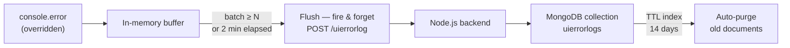

## Context

After migrating eight microfrontends from Angular 13 to Angular 18, the team had high confidence in the regression coverage — but production is never the same as QA. Edge cases escape. Browser environments vary. Users hit states that no test matrix anticipates.

The problem was that when something went wrong in the UI, there was no record of it. Errors surfaced only when a client raised a support ticket, at which point the team had nothing to work with except a vague description. Every incident started the same way: a triage call with dev, support, and the client, trying to reproduce something nobody could directly observe.

Months of regression work should not end with a shrug at production. The gap was observability — specifically, the complete absence of frontend error visibility in a system that runs across eight independent microfrontends.

## Problems

- Frontend errors disappeared silently into the browser console with no record
- Backend teams had no visibility into what the UI was actually doing at the time of failure
- Incident triage required coordinating developer, support, and client in the same call just to reproduce the error
- No correlation between what the user experienced and what appeared in server logs
- Mean time to reproduce was high; mean time to resolve was higher

## Architecture Decisions

The core design overrides `console.error` at the application bootstrap level. The override intercepts every error argument, appends it to an in-memory buffer, and returns immediately — no synchronous work, no impact on the calling code.

A flush is triggered by whichever condition fires first: the buffer reaching a batch size of 3–5 entries, or a 2-minute interval elapsing with any buffered entries. On flush, the buffer is drained and sent as a single POST to `/uierrorlog`. The endpoint writes one MongoDB document per request, containing the full error payload alongside metadata collected at capture time.

Each document in the collection includes:

| Field | Description |
|---|---|
| `timestamp` | UTC time the error was captured |
| `error` | Error message string |
| `stackTrace` | Full stack trace if available |
| `path` | `window.location.pathname` at capture time |
| `userAgent` | Browser and OS identity |
| `env` | Environment tag (`qa`, `uat`, `prod`) |

**Why `console.error` instead of Angular's `ErrorHandler`**

Angular's built-in `ErrorHandler` only intercepts errors thrown during change detection, component lifecycle hooks, and template evaluation. It does not capture raw `console.error` calls, browser API failures, or errors originating outside Angular's zone. In practice, the majority of production noise came from exactly those sources — making the built-in handler insufficient for this use case.

## Operational Constraints

The constraints on this system were as strict as the functional requirements. A logging subsystem that disrupts the application it is observing is worse than no logging at all.

**No UI performance impact.** The `console.error` override does synchronous work only to push to an array. The flush is fully asynchronous and decoupled from the UI thread. Users never wait for a log write.

**Fail-safe by design.** If the network request to `/uierrorlog` fails — timeout, server error, client offline — the failure is caught and silently discarded. The error is not re-queued, not retried, not surfaced. Logging must never propagate an exception back into the application.

**No blocking of user flows.** The flush is fire-and-forget: `fetch` is called with no `await` and no response handling in the calling path. The user's interaction continues regardless of what happens to the log request.

**Log explosion prevention.** A MongoDB TTL index on the `timestamp` field automatically purges documents older than 14 days. This bounds collection growth without requiring manual cleanup jobs or application-level filtering logic.

**Expected noise is tolerated, not filtered.** Client-side network failures are a known class of errors — they are real, but they are also frequent and rarely actionable. Rather than building filter logic at capture time (which adds complexity and misses edge cases), the 14-day TTL lets volume decay naturally. Operators querying the collection can filter by `error` prefix or `path` as needed.

## Validation / Rollout

The system was enabled per MFE, starting with the lowest-traffic module. For each rollout:

1. A known `console.error` call was intentionally triggered in QA.
2. The collection was queried to confirm the document appeared with the expected fields.
3. The `env` tag was verified to distinguish QA entries from production entries.

No feature flag was required. Because the flush is fail-safe and async, enabling the override carried no risk to the user experience — even if the backend was unreachable. This made progressive rollout straightforward: each MFE was enabled in sequence with verification, not gated behind a flag toggle.

## Outcome

The collection became the first place anyone looked when a client reported a UI issue. Timestamp and path were enough to retrieve the exact error a user had encountered — no triage call, no reproduction session, no dependency on the client's memory of what they were doing.

- Incident triage no longer requires a coordinated session between dev, support, and client
- Errors are searchable by timestamp, path, and environment from the moment they occur
- Reduced MTTR across all eight microfrontends — reproduction is a query, not a meeting
- The `console.error` override + batch + TTL pattern is now the default starting point for any new MFE added to the platform
