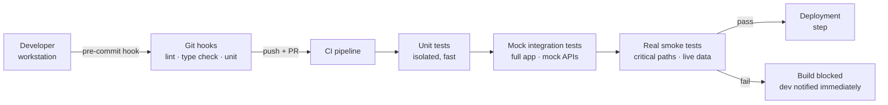

## Context

The team owned the frontend across multiple microfrontends, each with independent deployment cycles and separate owners. Code changes flowed through a standard path: developer commits, peer review, handoff to QA, and eventual deployment after sign-off.

On paper, this looked like a controlled process. In practice, it meant that defects were discovered days after the original change — often in an environment that had already drifted from what the developer tested locally. By the time QA picked up a ticket, the developer had moved on to other work. Context was cold. Feedback was slow. And the pressure to ship made every late-stage failure more disruptive than it needed to be.

The clearest illustration of this was a dependency upgrade to address a known vulnerability. The change itself was minimal — a version bump across several packages, no functional modification. There was no behavioral change in the application. But the change still needed to clear the standard QA queue. Days passed. By the time QA began validation, a downstream service became intermittently unavailable, introducing noise into the test environment. The ticket sat blocked. The vulnerability remained unpatched in production while the team waited on conditions outside their control.

That incident made the problem concrete: the validation timing was wrong. The cost of waiting had become measurable.

## Problems

The late-stage QA model carried several structural problems that compounded as the platform grew.

### Manual validation bottlenecks

QA capacity did not scale with the rate of changes. A small team handling tickets across multiple repositories created an inherent backlog. Priority mismatches between development and QA schedules were common.

### Environment instability at validation time

Lower environments were shared and unstable. A downstream service outage during QA blocked validation entirely, even for changes that had no integration surface with the affected service.

### Inconsistent standards across repositories

Different repositories had different levels of test coverage, different conventions, and no shared pipeline contract. Some had meaningful automated checks; others had none. QA became the single enforcement point by default.

### Developer dependency on QA for basic feedback

Changes that could have been validated automatically — build verification, unit correctness, basic integration smoke — were queued alongside complex behavioural validation. The queue treated all changes equally regardless of risk surface.

### Deployment anxiety

Without early validation, deployments went in with accumulated doubt. Everyone knew a late-stage failure would ripple back through the queue — and that pressure shaped how releases felt.

### Cross-team coordination overhead

In a multi-MFE environment, a failure discovered by QA late in the cycle often required coordinating with multiple teams to determine root cause and ownership. The later the discovery, the more people were pulled into diagnosis.

## Architecture Decisions

The core decision was to introduce layered validation that ran automatically, without manual intervention, at each stage of the delivery pipeline. The goal was not to replace QA entirely — it was to ensure that anything automatable was automated, and that QA time was reserved for genuinely behavioural, user-facing validation that required human judgement.

Validation was structured in four layers, each triggered at a progressively later stage and each covering a wider integration surface.

### Layer 1 — Git Hooks

The first layer ran on the developer's own machine before a commit was accepted. Hooks were configured to run linting, type checking, and unit tests for the files in scope. Fast. Local. No network dependency.

The intent was not to catch every defect at this stage — it was to give the developer an immediate signal before the code left their environment. A type error caught in three seconds is categorically cheaper than the same error discovered by QA two days later.

### Layer 2 — Unit Tests in CI

On push, the CI pipeline ran the full unit test suite in isolation. This covered logic correctness for components and services without any external dependency.

This layer was not new — most repositories had some unit tests already. The change was enforcement: the pipeline would not proceed if this step failed. Previously, test failures were visible but advisory; they became blocking.

### Layer 3 — Mock Integration Tests

The third layer ran the full application against mocked API responses. This covered end-to-end flows within the frontend without depending on lower-environment stability.

Mock integration tests were valuable precisely because they were independent of downstream availability. A downstream service outage did not affect this layer. The application's internal behaviour — routing, state transitions, error handling, form submission flows — was validated against a controlled, deterministic data layer.

This layer was the most significant investment. Writing and maintaining mock contracts required discipline, and the coverage was only as good as the scenarios defined. It also introduced a new source of maintenance overhead: as APIs evolved, mocks needed to follow.

### Layer 4 — Real Smoke Tests

The final pre-deployment layer ran a narrow set of integration tests against live data in the lower environment. These covered only the critical application paths — login, core data retrieval, primary workflow completion. Not exhaustive. Deliberately constrained.

The purpose was to confirm that the application connected correctly to real downstream services and that the fundamental contracts held. If a downstream service was unavailable at this stage, the build paused — but it had already passed layers 1 through 3, so the application's internal correctness was confirmed regardless.

### Pipeline Contract

Each repository adopted a shared pipeline template that enforced the layer structure. The template was versioned and maintained centrally, which ensured that new repositories inherited the full validation chain without requiring teams to reconstruct it from scratch.

## Operational Constraints

The rollout exposed several real constraints that shaped how the strategy was adopted.

### Legacy repositories

Several repositories had minimal or no test coverage. Enforcing the pipeline contract immediately would have blocked all deployments from those repositories. They required a phased path — advisory mode first, then gradual enforcement as coverage was added.

### Flaky tests

Some existing tests had intermittent failures that were unrelated to application correctness. Making these tests blocking meant the pipeline would fail on noise. Flaky tests needed to be identified, quarantined, and either stabilised or removed before enforcement could be trusted.

### Developer resistance to local hooks

Git hooks running on the local machine added latency to the commit cycle. Some developers bypassed them during rapid iteration. This was accepted as a tradeoff — the CI pipeline remained the authoritative enforcement point, with local hooks as an optional acceleration layer.

### CI resource contention

Running four validation layers per PR increased CI runtime and resource usage. On active repositories with frequent PRs, queue times increased. This was a real cost, not a negligible one.

### Balancing speed and enforcement

Some changes — documentation updates, configuration adjustments, safe dependency bumps — did not warrant the full validation chain. The pipeline was extended to support path-scoped skipping for changes with no code surface, reducing unnecessary CI load.

## Rollout Strategy

Enforcement was introduced incrementally, not as a single policy switch.

The first phase was advisory mode. The pipeline ran all validation layers, but failures were reported rather than blocking. Teams could see the results without being blocked by them. This phase ran for several weeks and served two purposes: it surfaced the current state of coverage across repositories, and it gave teams time to stabilise failing tests before enforcement landed.

The second phase introduced blocking enforcement on new repositories only. Repositories with healthy coverage became the initial enforcement boundary. New projects and recently onboarded repositories adopted the contract from the start.

The third phase extended enforcement incrementally to legacy repositories, paced by coverage milestones. A repository with at least 60% unit test coverage and no persistent flaky tests became eligible for enforcement. Teams were given a target window and support to reach it.

The final phase brought all active repositories under full enforcement. By this point, the system had been running in advisory mode long enough that most teams had already adopted the conventions voluntarily.

## Tradeoffs

This approach was not without cost, and documenting those costs honestly is part of understanding the strategy.

### Slower PR cycles in the early phase

Adding validation layers to the pipeline increased the time between a PR opening and the developer receiving a result. For teams accustomed to fast merges, this was friction.

### CI cost

More validation steps meant more compute time per PR. At scale, across multiple active repositories, this was a meaningful budget consideration.

### Test maintenance overhead

Mock integration tests, in particular, required sustained maintenance. API contracts change. New endpoints are introduced. Existing mocks drift from reality if not kept in sync. The maintenance burden was real and required deliberate ownership.

### Flaky test ownership

Flaky tests in a blocking pipeline are worse than flaky tests in an advisory one. Once enforcement was live, any test that failed intermittently became an incident. Owning and resolving test flakiness became a first-class engineering concern, not a background task.

### Coverage as a false confidence signal

High test coverage does not mean high defect detection. Teams that rushed to add superficial tests to reach the coverage threshold before enforcement landed produced coverage numbers that looked healthy but did not meaningfully improve confidence. Coverage is a proxy, not a guarantee.

## Outcome

The most direct outcome was lead time. Changes that previously spent two to four days waiting for QA validation were clearing the pipeline in two to four hours. For low-risk changes like dependency upgrades, documentation updates, and configuration adjustments, the cycle collapsed almost entirely — the pipeline confirmed correctness, and deployment proceeded.

QA capacity shifted toward genuinely complex validation: user journeys, cross-browser edge cases, accessibility, and scenarios that required human interpretation rather than automated assertion. QA engineers reported spending less time on changes that were straightforwardly correct and more time on changes that actually needed their judgement.

Deployment anxiety reduced noticeably. Teams going into a release with four layers of confirmed validation had a different posture than teams going in having committed to paper that a manual review had been completed. The confidence was grounded in evidence rather than attestation.

Defects that previously reached QA — or worse, production — began surfacing at the unit and mock integration layer. The later a defect was caught, the more context had been lost and the more teams were involved in resolution. Catching it earlier kept the cost of the fix proportional to its complexity.

Cross-team coordination overhead during release cycles decreased. When every repository in a release had cleared a consistent validation chain, the question of whether something was ready became less ambiguous.

## Closing Insight

Validation is not a phase — it is a timing decision. Moving validation earlier does not change what gets checked; it changes what that check costs when it finds something.

A defect caught by a git hook costs the developer thirty seconds. The same defect caught by QA two days later costs a ticket, a context switch, a reproduction effort, and a return to work the developer has since moved past. In a distributed system with multiple repositories and independent delivery cycles, that cost multiplies.

The shift-left framing is sometimes used to mean "write more tests." That is a narrow reading. The more useful framing is: _every hour of delay between code creation and validation is a cost that compounds when something is wrong_. The question is not whether to validate, but when — and who pays when the answer is too late.

Stronger engineering ownership of validation quality, not just coverage numbers, is what makes this system durable. Tooling creates the possibility. Teams that understand why the pipeline exists maintain it in good faith. Teams that treat it as a gate to be cleared will find ways around it.

The pipeline is only as good as the engineers who trust it.
