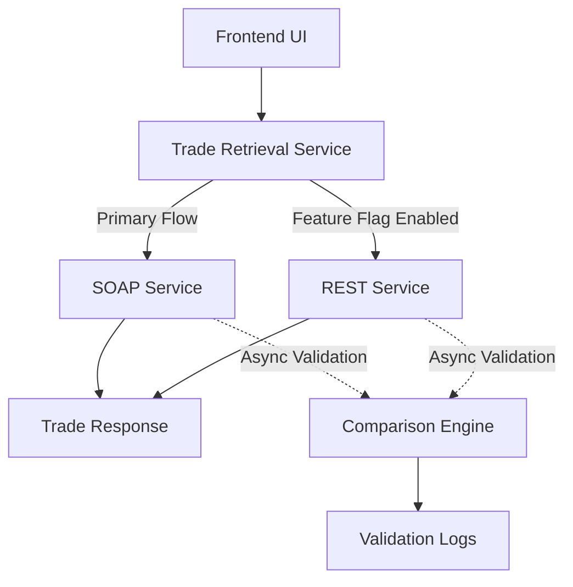

## Context

The existing trade retrieval workflow depended on a downstream SOAP service with inconsistent latency characteristics. Response times regularly ranged from 2–5 minutes, and intermittent downstream instability required a MongoDB cache layer as a defensive fallback.

While the cache reduced user-facing delays, it introduced data staleness concerns and increased operational complexity. The system had effectively become dependent on cached trade snapshots rather than the downstream service itself.

The goal of the modernization effort was not only to reduce latency, but also to simplify the operational model and reduce long-term dependency on stale cached data.

The downstream SOAP service was externally owned, which meant the migration strategy needed to account for limited control over downstream behavior, inconsistent lower-environment datasets, and operational unpredictability.

## Architecture Decisions

### UI Isolation From Retrieval Strategy

The UI layer was intentionally isolated from the underlying retrieval implementation so that the migration could proceed transparently behind a stable contract.

This allowed the SOAP and REST implementations to evolve independently without introducing UI-level migration complexity.

### Feature-Flag Controlled Rollout

A runtime configuration flag (`enableRest`) was introduced to dynamically control whether requests should flow through the legacy SOAP implementation or the new REST path.

The flag was stored in MongoDB rather than application configuration files so that rollout behavior could be adjusted without requiring microservice redeployments.

This decision allowed:

- incremental rollout
- rapid rollback
- controlled validation
- operational flexibility during migration

### Rollback-First Migration Strategy

The migration strategy prioritized reversibility over speed of delivery.

Even after REST adoption, the architecture intentionally retained the SOAP flow as a fallback path until sufficient operational confidence was established.

This reduced rollout risk significantly and allowed the REST implementation to be validated under real production traffic conditions before fully decommissioning the legacy dependency path.

## Validation Strategy

Initial validation proposals focused on scheduled comparison jobs that periodically called both SOAP and REST services using fixed payloads and compared the resulting datasets.

However, this approach had major limitations:

- validation coverage was narrow
- payload diversity was unrealistic
- high-value client scenarios could not be adequately represented
- lower environments contained inconsistent downstream datasets

The final strategy introduced production shadow validation.

Whenever a live SOAP request was processed, an asynchronous background thread would independently execute the equivalent REST request using the same payload. The resulting datasets were then compared and logged without affecting user-facing latency.

This allowed:

- production-grade payload validation
- large-scale comparison coverage
- realistic traffic validation
- incremental confidence building during rollout

A key operational constraint was that lower environments could not provide reliable validation because the downstream SOAP and REST systems were backed by inconsistent datasets.

As a result, meaningful comparison validation was only possible in production traffic scenarios.

This constraint had existed for years, and the migration effort became an opportunity to finally address the validation gap through controlled production validation.

### Validation Flow

## Tradeoffs

### Temporary Dual Execution Complexity

During the migration phase, both SOAP and REST systems needed to execute simultaneously for comparison purposes. This temporarily increased operational complexity and downstream request volume.

### Production Validation Requirements

Validating in production increased migration confidence substantially, but required careful isolation to ensure that comparison logic never impacted user-facing latency.

### Retaining SOAP Fallback Paths

Maintaining the legacy SOAP fallback path increased short-term system complexity, but significantly reduced migration and rollout risk while operational confidence in the REST implementation matured.

## Outcome

The migration significantly reduced latency variability, improved operational confidence, and enabled the gradual retirement of the stale-cache fallback.

The rollout strategy established reusable patterns for:

- service modernization
- rollout safety
- feature-flag controlled migrations
- production validation
- rollback-oriented architecture decisions

More importantly, the project reinforced an operational principle that became increasingly valuable across modernization efforts:

Reliable rollback strategies are often more important than aggressive rollout strategies.
