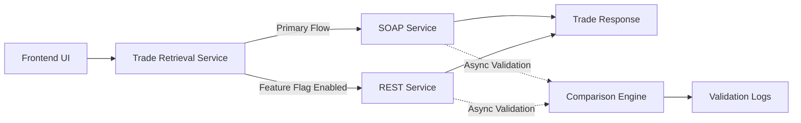

## Context

The existing trade retrieval workflow depended on a downstream SOAP service with inconsistent latency characteristics. Response times regularly ranged from 2–5 minutes, and intermittent downstream instability required a MongoDB cache layer as a defensive fallback.

While the cache reduced user-facing delays, it introduced data staleness concerns and increased operational complexity. The system had effectively become dependent on cached trade snapshots rather than the downstream service itself.

The goal was not just to reduce latency — it was to simplify the system and stop depending on a cache of stale trade data as the primary data source.

The downstream SOAP service was externally owned. That meant limited control over its behavior, inconsistent data in lower environments, and no guarantees around availability.

## Architecture Decisions

### UI Isolation From Retrieval Strategy

The UI layer was intentionally isolated from the underlying retrieval implementation so that the migration could proceed transparently behind a stable contract.

This allowed the SOAP and REST implementations to evolve independently without introducing UI-level migration complexity.

### Feature-Flag Controlled Rollout

A runtime configuration flag (`enableRest`) was introduced to dynamically control whether requests should flow through the legacy SOAP implementation or the new REST path.

The flag was stored in MongoDB rather than application configuration files so that rollout behavior could be adjusted without requiring microservice redeployments.

This made it possible to roll out incrementally, roll back instantly, and validate behavior in production — without redeploying anything.

### Rollback-First Migration Strategy

The migration strategy prioritized reversibility over speed of delivery.

Even after switching to REST, the SOAP path was kept live as a fallback until confidence was established in production.

This kept the risk low and meant the REST implementation got validated against real traffic before the legacy path was turned off.

## Validation Strategy

Initial validation proposals focused on scheduled comparison jobs that periodically called both SOAP and REST services using fixed payloads and compared the resulting datasets.

However, this approach had major limitations:

- validation coverage was narrow
- payload diversity was unrealistic
- high-value client scenarios could not be adequately represented
- lower environments contained inconsistent downstream datasets

The final strategy introduced production shadow validation.

Whenever a live SOAP request was processed, an asynchronous background thread would independently execute the equivalent REST request using the same payload. The resulting datasets were then compared and logged without affecting user-facing latency.

This allowed:

- production-grade payload validation
- large-scale comparison coverage
- realistic traffic validation
- incremental confidence building during rollout

Lower environments had inconsistent downstream datasets, so validation there was unreliable. Meaningful comparison was only possible against live production traffic.

This had been a known gap for years. The migration gave us a reason to finally close it.

### Validation Flow

## Tradeoffs

### Temporary Dual Execution Complexity

During the migration phase, both SOAP and REST systems needed to execute simultaneously for comparison purposes. This temporarily increased operational complexity and downstream request volume.

### Production Validation Requirements

Validating in production increased migration confidence substantially, but required careful isolation to ensure that comparison logic never impacted user-facing latency.

### Retaining the SOAP Fallback

Keeping SOAP live alongside REST made the system more complex in the short term. That was worth it — the REST implementation needed time in production before the fallback could be safely retired.

## Outcome

Latency dropped substantially. The stale cache dependency was retired. The system got simpler.

The shadow validation approach worked well enough that it influenced how later migrations handled the lower-environment data problem — rather than ignoring it or building complex fixture setups, validating in production with isolated async comparison became the default answer.

The principle that came out of this is straightforward: a fast rollback path removes more risk than a fast rollout plan. We kept the SOAP path live far longer than strictly necessary — and that was the right call.
