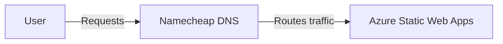
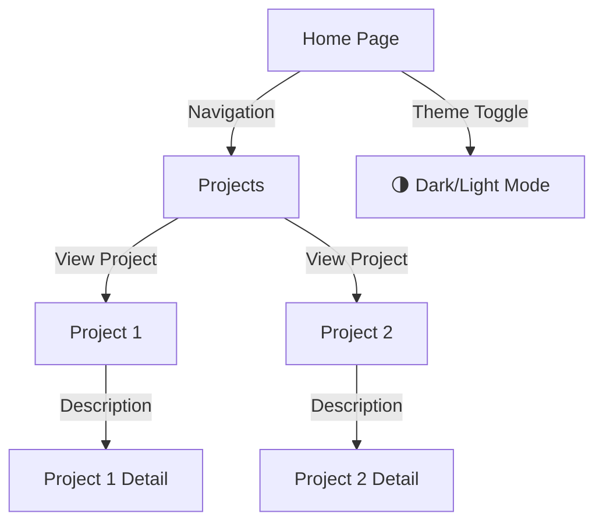

# Overview

[abhish3kk.in](https://abhish3kk.in) is my personal website designed to showcase my skills, projects, and technical expertise. It is built with Vue 3 and deployed on Azure Static Web Apps, integrating Pinia for state management and a modular architecture.

## Build & Run

The project uses **Vite** for development and build processes. Below are the key scripts defined in `package.json`:

```json
"scripts": {
    "dev": "vite",
    "build": "vue-tsc -b && vite build",
}
```

- To start the development server:

```sh
npm run dev
```

- To build the project for production:

```sh
npm run build
```

## Architecture

This section describes how traffic flows from the client to the hosted application.

### Network Flow



### Application Flow


