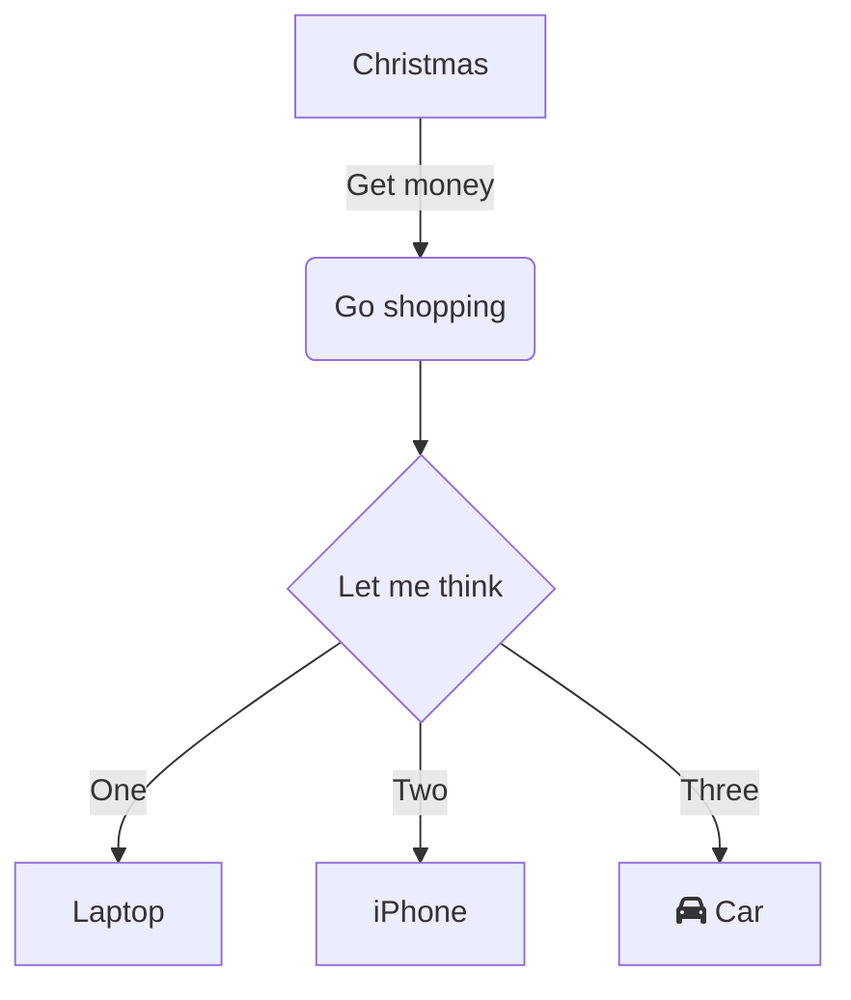

# 📌 Project Name

## 🚀 Description

A brief overview of what the project does, its purpose, and key features.

## 🏷️ Tech Stack

- `React`
- `Node.js`
- `Express`
- `SQLite`
- `Azure Static Web Apps`
- `Azure Web App`

## 📜 Features

- ✅ Feature 1
- ✅ Feature 2
- ✅ Feature 3

## 🏗️ Architecture

```plaintext
Frontend (React) -> Backend (Node.js) -> Database (SQLite)
```


