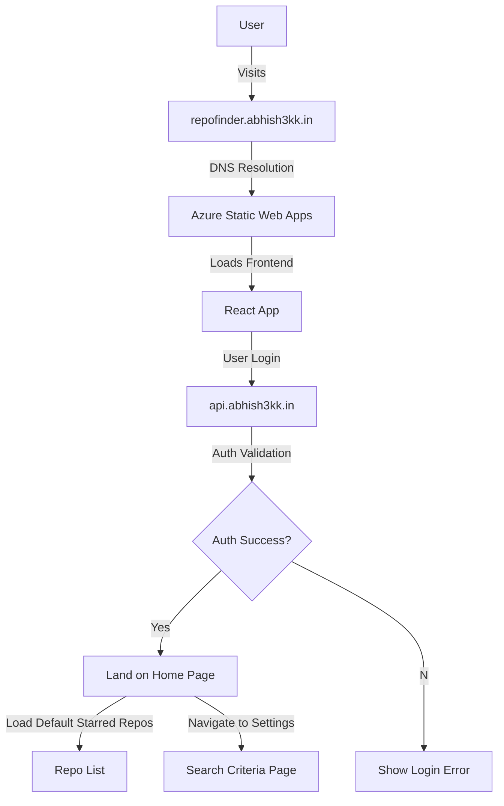

# RepoFinder

**Live URL:** [repofinder.abhish3kk.in](https://repofinder.abhish3kk.in)

## Overview

RepoFinder allows users to search GitHub repositories based on various filters such as topics, languages, stars, sorting order, and result limits. Users can log in to save their search preferences.

## Features

- **Dynamic Repository Search:** Filter by topic, language, stars, sort order, per-page limit.
- **User Authentication:** JWT-based authentication (expires in 1 day).
- **Saved Preferences:** Logged-in users can save search settings.
- **Dynamic Routing:** Each selected topic creates its own route.
- **API Documentation:** Uses Swagger for testing API endpoints.

## Tech Stack

### Frontend

- React.js
- TypeScript
- React Router (for dynamic routing)
- Tailwind CSS (for styling)

### Backend

- Node.js + Express.js (TypeScript)
- JWT-based authentication
- Swagger (for API testing/documentation)

## Authentication

- Uses **JWT tokens** for secure authentication.
- Tokens expire after **1 day**.
- Login required to save search preferences.

## API Usage

The backend provides an API to fetch repositories based on filters. The API documentation is available via Swagger.

## Dynamic Routing

Each GitHub topic generates its own route dynamically, enabling deep linking to filtered repository lists.

## Deployment

- **Frontend:** Hosted on Azure Static Web Apps.
- **Backend:** Deployed as an Azure Web App.

## Architecture Diagram

## Future Enhancements

- User favorites system to save and revisit preferred repositories.
- Improved caching for faster results.
- Multi-language support for a global audience.

---

For more details, visit [repofinder.abhish3kk.in](https://repofinder.abhish3kk.in).
